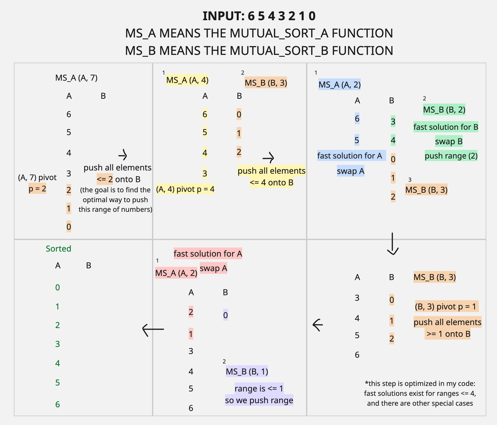

<h1>**push_swap is part of the second milestone of the 42 Common Core**</h1>

The PDF of the original subject is attached.

The goal is to sort a non-repeating stack of integers the most efficiently possible using a set of limited operations, and the help of only one other stack.

For minimal validation (which implies a minimum grade of 80), we must sort 100 random numbers in fewer than 700 operations.
For maximum project validation and eligibility for bonuses, we must meet the first condition above and for 500 random numbers, there should be no more than 5500 operations.

I enjoyed this project and spent a lot of time trying to optimize it, and still doing so...

The available operations are:

**sa** (swap a): Swap the first 2 elements at the top of stack a.

Do nothing if there is only one element or none.

**sb** (swap b): Swap the first 2 elements at the top of stack b.

Do nothing if there is only one element or none.

**ss** : sa and sb at the same time.

**pa** (push a): Take the first element at the top of b and put it at the top of a.

Do nothing if b is empty.

**pb** (push b): Take the first element at the top of a and put it at the top of b.

Do nothing if a is empty.

**ra** (rotate a): Shift up all elements of stack a by 1.

The first element becomes the last one.

**rb** (rotate b): Shift up all elements of stack b by 1.

The first element becomes the last one.

**rr** : ra and rb at the same time.

**rra** (reverse rotate a): Shift down all elements of stack a by 1.

The last element becomes the first one.

**rrb** (reverse rotate b): Shift down all elements of stack b by 1.

The last element becomes the first one.

**rrr** : rra and rrb at the same time.

-------------------------------------

**My algorithm (inspired by quicksort):**

For a range of ints (len), we will have to introduce a pivot (p) that represents:

  - For A: the element in A such that there are len/2 numbers greater than p if len is pair, and len/2 + 1 numbers greater than p if len is not pair.

  - For B: the element in B such that there are len/2 numbers less than p if len is pair, and len/2 + 1 numbers less than p if len is not pair.

**Example:**

If A has {6,5,4,3,2,1,0}, its length is 7.

For the range n = 7, the pivot would be p = 2 because n is not pair and there are 7/2 + 1 = 3 + 1 = 4 elements in A that are greater than 2 (the set {6,5,4,3}).

If A has {6,5,4,3,2,1}, its length is 6. 

For the range n = 6, the pivot would be p = 3 because n is pair and there are 6/2 = 3 elements in A that are greater than 3 (the set {6,5,4}).

If B has {6,5,4,3,2,1,0}, its length is 7.

For the range n = 7, the pivot would be p = 4 because n is not pair and there are 7/2 + 1 = 3 + 1 = 4 elements in B that are less than 4 (the set {3,2,1,0}).

If B has {6,5,4,3,2,1}, its length is 6. 

For the range n = 6, the pivot would be p = 4 because n is pair and there are 6/2 = 3 elements in B that are less than 4 (the set {3,2,1}).

We will have 2 separate sorting functions for A and B that work recursively and mutually: mutual_sort_a, and mutual_sort_b. Both of them take a stack, and a number representing the range we want to sort.

We start with a number (n) of elements in stack A, and no elements in stack B.

BASIC LOGIC (modified in the code to optimize further):

We apply MUTUAL_SORT_A to A, **using the length n as range**:

 **MUTUAL_SORT_A:**

  -> if the range taken as argument is <= 2 or the numbers in this range are sorted, stop.
  
  -> find the pivot p of stack A using the range taken as argument.
  
  -> push all numbers <= p onto stack B.

  -> after pushing this range of numbers, call MUTUAL_SORT_A to A on on what is left of the original range used as argument.

  -> apply MUTUAL_SORT_B to B using the number of pushed elements as its range argument.

**MUTUAL_SORT_B:**
  
  -> if the range taken as argument is <= 2 or the numbers in B in this range are sorted, push the range of numbers on A and stop.

  -> find the pivot p of stack B using the range taken as argument.

  -> push all numbers >= p onto stack A.

  -> after pushing this range of numbers, call MUTUAL_SORT_A using the range as argument.

  -> apply MUTUAL_SORT_B to B using what is left of the original range as its range argument.

-------------------------------------

**Example:**

Lots of small optimization changes were made, I need to annotate them.

[!] Does not pass NORMINETTE because i am trying to make it more efficient.

-------------------------------------

CURRENT AVERAGE:

- 100 NUMBERS: ~626 moves

- 500 NUMBERS: ~4800 moves

-------------------------------------

**Bonus**

Write a checker program that checks if a list of instructions successfully sorts a list on numbers.

Grade: 125
